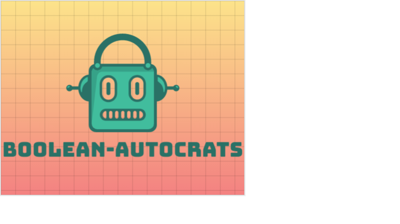

<!-- PROJECT LOGO -->
 

  <a> &nbsp;&nbsp;&nbsp;&nbsp;&nbsp;&nbsp;&nbsp;&nbsp;&nbsp;&nbsp;&nbsp;&nbsp;&nbsp;&nbsp;&nbsp;&nbsp;&nbsp;&nbsp;&nbsp;&nbsp;&nbsp;&nbsp;&nbsp;&nbsp;&nbsp;&nbsp;&nbsp;&nbsp;&nbsp;&nbsp;&nbsp;&nbsp;&nbsp;&nbsp;&nbsp;&nbsp;&nbsp;&nbsp;&nbsp;&nbsp;&nbsp;
  </a>

  <h3 align="center">Lumen Tech Jam 2021</h3>

  

    Check below links to understand our POC!
     
    <a href="designDoc.docx"><strong>Download Api Doc »</strong></a>
     
     
    <a href="https://github.com/vats-shashank/boolean-autocrat/blob/main/flow.png">Api Flow</a>
    .
    <a href="https://github.com/vats-shashank/boolean-autocrat/blob/main/notificationFlow.png">Notification Flow</a>
    .
    <a href="https://github.com/vats-shashank/boolean-autocrat/blob/main/scheduledNotificationFlow.png">Schedule Notification Flow</a>
    .
   <a href="mailto:shashank.vats@lumen.com; Rajeev.K.Singh@lumen.com; Poojamonal.Bhoyar@centurylink.com; Harshith.Venkatesh@centurylink.com    ;Manoranjan.Mishra@centurylink.com?subject=Reporting bug in Api Catalog For Maximum Reuse&body=Hi Boolean-Autocrats,">Report Bug</a>
    .
    <a href="mailto:shashank.vats@lumen.com; Rajeev.K.Singh@lumen.com; Poojamonal.Bhoyar@centurylink.com; Harshith.Venkatesh@centurylink.com ;Manoranjan.Mishra@centurylink.com">Request Feature</a>
  

