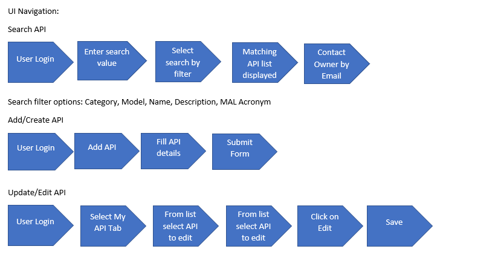

<!-- PROJECT LOGO -->
 

  <a href="https://github.com/vats-shashank/boolean-autocrat">
    &nbsp;&nbsp;&nbsp;&nbsp;&nbsp;&nbsp;&nbsp;&nbsp;&nbsp;&nbsp;&nbsp;&nbsp;&nbsp;&nbsp;&nbsp;&nbsp;&nbsp;&nbsp;&nbsp;&nbsp;&nbsp;&nbsp;&nbsp;&nbsp;&nbsp;&nbsp;&nbsp;&nbsp;&nbsp;&nbsp;&nbsp;&nbsp;&nbsp;&nbsp;&nbsp;&nbsp;&nbsp;&nbsp;&nbsp;&nbsp;&nbsp;
  </a>

  <h3 align="center">Lumen Tech Jam 2021</h3>

  

    Read below to understand our POC!
     
    <a href="designDoc.docx"><strong>Explore the docs »</strong></a>
     
     
    <a>
      
      View Demo
    </a>
    ·
    <a href="mailto:shashank.vats@lumen.com; Rajeev.K.Singh@lumen.com; Poojamonal.Bhoyar@centurylink.com; Harshith.Venkatesh@centurylink.com ;Manoranjan.Mishra@centurylink.com">Report Bug</a>
    ·
    <a href="mailto:shashank.vats@lumen.com; Rajeev.K.Singh@lumen.com; Poojamonal.Bhoyar@centurylink.com; Harshith.Venkatesh@centurylink.com ;Manoranjan.Mishra@centurylink.com">Request Feature</a>
  

